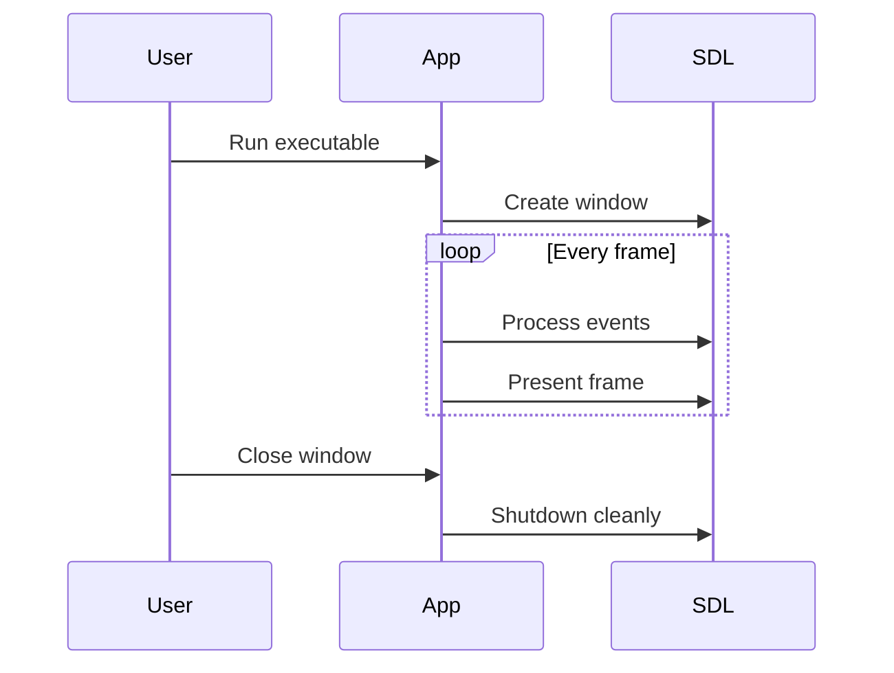
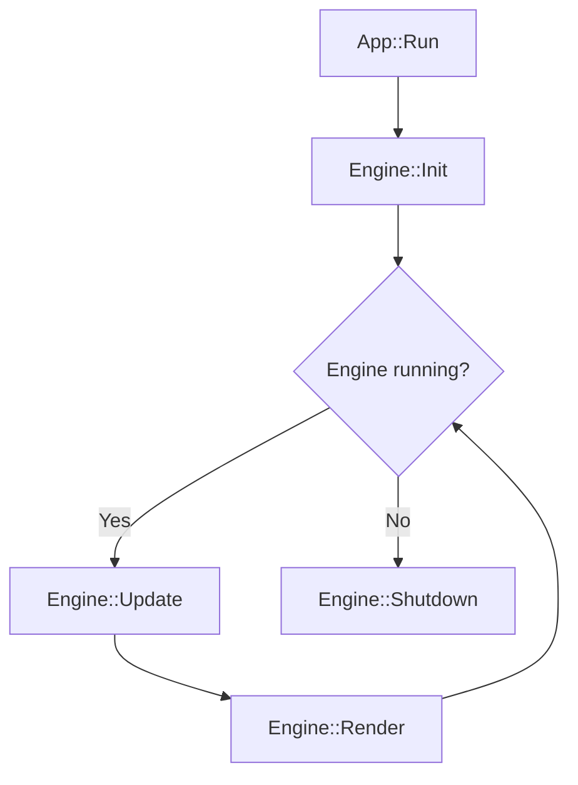
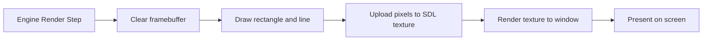
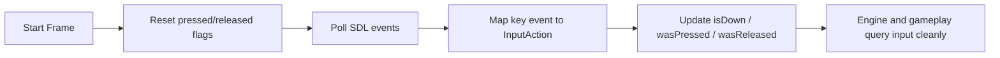
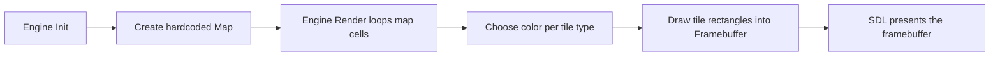

# Neo Wolf Learning Notes

## Subheading: The things you asked for
Layman knowledge of the process done so far, clearly split by phase, with diagrams and tables.

## Project Snapshot
This note documents what is implemented through Phase 7.

| Phase | Name | Status | Core Outcome |
|---|---|---|---|
| 1 | Project Bootstrap | Complete | App opens an SDL window and runs a loop |
| 2 | Engine Skeleton | Complete | Engine lifecycle split into clean modules |
| 3 | Software Framebuffer | Complete | Engine draws into CPU memory, then SDL presents it |
| 4 | Basic Math and Utility Layer | Complete | Reusable math, color, and logging helpers are available |
| 5 | Input System | Complete | Keyboard input is mapped to engine actions with edge detection |
| 6 | Grid Map System | Complete | Engine owns a tile map and renders a top-down debug view |
| 7 | Player Controller and Collision | Complete | Player movement/rotation/strafe and wall collision are validated in runtime |

---

## Big Picture (Simple)
Imagine building a game like building a shop:
- Phase 1: You build the building and open the door.
- Phase 2: You assign departments (front desk, operations, shutdown).
- Phase 3: You install your own drawing board and paint there first, then hang it in the window.
- Phase 4: You create a basic toolkit (ruler, calculator, labels) so future work is cleaner.
- Phase 5: You create a control panel so key presses become game-ready actions.
- Phase 6: You place a floor plan on the board so the world has real tiles and walls.
- Phase 7: You add a controllable player that moves inside that floor plan without walking through walls.

```mermaid
flowchart LR
    A[Phase 1: Window + Loop] --> B[Phase 2: Engine Structure]
    B --> C[Phase 3: CPU Framebuffer]
    C --> D[Phase 4: Math and Utilities]
    D --> E[Phase 5: Input System]
    E --> F[Phase 6: Grid Map + Top-Down Debug Render]
    F --> G[Phase 3-6 Logic Tests Added]
    G --> H[Phase 7: Player Movement + Collision]
    H --> I[Ready for Phase 8 Raycasting Core]
```



---

## Phase 1: Project Bootstrap

### In layman terms
You proved the game can start, keep running, and exit safely.  
This is like turning on a machine for the first time and confirming it does not crash.

### What was built

| Item | Meaning in simple terms | Why it matters |
|---|---|---|
| CMake project | Build recipe for the app | Team can build consistently |
| SDL2 window | A visible screen window | Required for game display |
| Main loop | Repeats every frame | Foundation of all game logic |
| FPS/frame time print | Basic performance heartbeat | Helps early debugging |

### Phase 1 flow


---

## Phase 2: Engine Skeleton

### In layman terms
You organized one big blob into clear responsibilities:
- `App` runs the high-level loop
- `Engine` controls lifecycle
- `PlatformSDL` handles SDL-specific details

This is like moving from a messy workshop to labeled tool drawers.

### What was built

| Module | Plain meaning | Responsibility |
|---|---|---|
| `App` | Top-level runner | Starts engine, drives frame loop |
| `Engine::Init` | Startup step | Creates platform and initial state |
| `Engine::Update` | Logic step | Updates time, pumps input, handles quit |
| `Engine::Render` | Draw step | Calls drawing path each frame |
| `Engine::Shutdown` | Cleanup step | Releases resources safely |
| `PlatformSDL` | SDL wrapper | Window, renderer, events, presentation |
| `InputState` | Input memory | Stores quit/action states |
| `TimeState` | Time memory | Delta time, total time, frame index |

### Lifecycle diagram


---

## Phase 3: Software Framebuffer

### In layman terms
Before, SDL painted directly to screen.  
Now, the engine paints to its own pixel sheet in memory first, then sends that sheet to SDL to display.

This is like drawing on paper at your desk, then placing that paper on a shop window every frame.

### What was built

| Feature | Layman explanation | Technical role |
|---|---|---|
| `Framebuffer` class | Engine-owned pixel canvas | Stores width, height, pixel array |
| `Clear(color)` | Fill the whole canvas with one color | Reset frame background |
| `PutPixel(x,y,color)` | Color one exact dot | Primitive building block |
| `DrawVerticalLine(...)` | Draw one upright line | Useful for raycast wall columns later |
| `DrawRect(...)` | Draw a filled box | Debug and primitive rendering |
| SDL texture upload | Copy canvas to a GPU texture | Bridge CPU drawing to display |
| Present framebuffer | Show uploaded texture in window | Final screen output |

### Frame pipeline now


### Data movement table

| Stage | Data owner | What happens |
|---|---|---|
| Build frame | Engine (`Framebuffer`) | CPU writes raw pixels |
| Upload | PlatformSDL | Pixels copied into SDL texture |
| Display | SDL renderer | Texture is shown in window |

---

## Phase 4: Basic Math and Utility Layer

### In layman terms
You added a toolbox so future systems (input, movement, map logic, raycasting) can reuse clean building blocks instead of repeating raw calculations everywhere.

### What was built

| Utility | Layman explanation | Technical role |
|---|---|---|
| `Vec2` | A 2D point/direction container | Base type for movement and ray math |
| Vec2 functions (`Add`, `Subtract`, `Scale`) | Small math operations | Cleaner movement and directional code |
| Vec2 functions (`Length`, `Normalize`, `Dot`) | Measure size, make unit direction, compare directions | Core for gameplay/raycast formulas |
| `Vec2i` | Grid-friendly integer 2D coordinate | Useful for map tiles/cells |
| `Clamp` | Keep a number inside safe limits | Prevent invalid ranges |
| Degree/radian conversions + angle normalize | Convert and stabilize angles | Avoid angle drift and wrap bugs |
| Color helpers | Standardize color packing | Consistent renderer color handling |
| Logging utility | Structured info/warn/error messages | Easier diagnostics during development |

### How this helps next phases

| Next phase area | Reuse from Phase 4 |
|---|---|
| Input and controller logic | Angle helpers + clamp + logging |
| Map and collision | `Vec2`, `Vec2i`, normalization, dot |
| Raycasting | Vector ops + angle conversions + clamp |

---

## Phase 5: Input System

### In layman terms
Keyboard events are now translated into engine actions, so the rest of the game asks clear questions like:
- "Is move-forward held?"
- "Was interact pressed this frame?"

This keeps SDL details inside the platform layer and keeps gameplay code cleaner.

### What was built

| Feature | Layman explanation | Technical role |
|---|---|---|
| Action enum | Named controls instead of raw keys | Standard action API for engine/gameplay |
| Per-action state | Each action tracks current/up/down transitions | Supports continuous and one-shot input |
| Edge detection | Detect press/release exactly on transition frame | Needed for toggles, interaction, menus |
| SDL key mapping | W/A/S/D, arrows, E, Escape map to actions | Converts hardware events to engine language |
| Frame reset | Transition flags reset every frame before polling | Prevents stale press/release events |

### Action mapping table

| Key | Action |
|---|---|
| `W` | move forward |
| `S` | move backward |
| `A` | strafe left |
| `D` | strafe right |
| `Left Arrow` | turn left |
| `Right Arrow` | turn right |
| `E` | interact |
| `Escape` | pause |

### Input flow diagram


---

## Phase 6: Grid Map System

### In layman terms
The project now has a real tile-based world layout instead of only generic render primitives.
You can see that layout directly as a top-down debug map.

### What was built

| Feature | Layman explanation | Technical role |
|---|---|---|
| `Map` class | A 2D board of tiles | Stores world width, height, and cell data |
| Tile types | Different kinds of map cells | `Empty`, `Wall`, `Door`, `Trigger` |
| Map queries | Ask what exists in a tile | `GetCell`, `IsInsideMap`, `IsWall` |
| Hardcoded test level | A starter sample map | Allows deterministic debugging before file loading |
| Top-down debug render | Draw each tile as a rectangle | Visual confirmation that map logic and render path match |

### Phase 6 data flow


---

## Phase 7: Player Controller and Collision

### In layman terms
The map is no longer static. A player marker can now move, rotate, strafe, and collide against wall tiles.

### What was built

| Feature | Layman explanation | Technical role |
|---|---|---|
| `Player` state | A character record with movement properties | Stores position, facing angle, move speed, turn speed, collision radius |
| Forward/back movement | Move in facing direction | Uses current angle to compute direction vector |
| Strafe movement | Move sideways relative to facing | Uses perpendicular vector to direction |
| Rotation | Turn left/right | Updates facing angle continuously from input |
| Wall collision | Stop walking through walls | Checks attempted movement against map wall cells |
| Top-down player debug view | See player behavior clearly | Draws player marker and facing line over map |

---

## Why this progression is correct

| Order | Reason |
|---|---|
| Phase 1 first | Need a runnable app before architecture work |
| Phase 2 second | Need structure before adding real rendering complexity |
| Phase 3 third | Need engine-owned pixels before raycasting features |
| Phase 4 fourth | Need reusable math/utilities before heavy gameplay and ray logic |
| Phase 5 fifth | Need clean engine input API before player/controller and gameplay logic |
| Phase 6 sixth | Need map data + queries before adding player collision and ray hits |
| Phase 7 seventh | Need validated movement/collision before first-person ray rendering |

---

## Current mental model
Use this one-liner:

`Input comes from SDL -> Engine updates state -> Engine draws into its framebuffer -> SDL presents that framebuffer`

---

## What `neo_wolf.exe` Is Right Now

When you run `neo_wolf.exe`, you are running a single native app that includes both:

- the engine runtime (window loop, input system, map/render systems), and
- the current game-side logic/content stub (hardcoded map and debug draw behavior).

So this stage is not split into separate binaries yet. It is one executable with engine and current gameplay logic compiled together.

---

## Is This Engine Code-Based?

Yes, at this stage it is code-driven:

- systems are implemented in C++ source,
- content is still mostly hardcoded,
- there is no visual editor or external gameplay scripting pipeline in active use yet.

Later phases introduce external files and C# gameplay interop, but the current setup is code-first.

---

## How To Run Phase 3-6 Logic Tests

Use this exact flow from the project root:

1. Build Debug (includes `neo_wolf_tests.exe`):
```powershell
.\build.cmd Debug
```

2. Run all registered CMake/CTest tests:
```powershell
ctest --test-dir build -C Debug --output-on-failure
```

3. (Optional) Run the test binary directly to see per-test pass lines:
```powershell
.\build\neo_wolf_tests.exe
```

Expected result:
- `ctest` should report `100% tests passed`.
- Direct run should print `[PASS]` lines for:
  - Vec2 and math helpers
  - InputState transitions
  - Map queries

If `ctest` says `No tests were found`:
- run `.\build.cmd Debug` again to regenerate CMake files with the test target,
- then rerun `ctest --test-dir build -C Debug --output-on-failure`.

---

## Quick glossary (non-technical)

| Term | Plain meaning |
|---|---|
| Frame | One screen refresh step in the loop |
| Framebuffer | A memory image made of pixels |
| Pixel buffer | The raw array holding all pixel colors |
| Render | The act of drawing a frame |
| Present | Showing the finished frame on screen |
| Delta time | Time passed since previous frame |

---

## Next learning target
1. Phase 8: raycasting core (column rays, wall hit distance, projected wall slices).
2. Keep Phase 3-6 tests green while adding new ray-step and distance tests.

---

## Quick test now (without debugger)
You can still validate the current build without setting breakpoints:

1. Build and run logic tests (`ctest --test-dir build -C Debug --output-on-failure`).
2. Run the app and confirm the window title shows `Raycast Engine - Phase 7`.
3. Confirm movement with `W/A/S/D`, rotation with arrow keys, and collision against wall tiles.
4. Confirm the app closes cleanly from window `X`.

Note: next implementation focus is Phase 8 raycasting.
